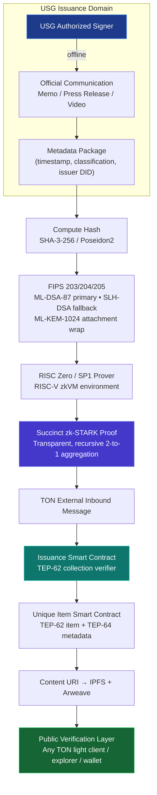

# PQ-SC-USG Protocol Architecture

**Document ID:** PQ-SC-USG-ARCH-001  
**Version:** Draft v0.3 (August 2026)  
**Settlement chain:** TON only  
**Systems Engineering Level:** Concept → Preliminary Design (PDR ready)  
**Approval Status:** IPT Draft – Pending PDR Gate

See also: [draft-architecture.md](draft-architecture.md)

## 1. High-level architecture (functional flow)

